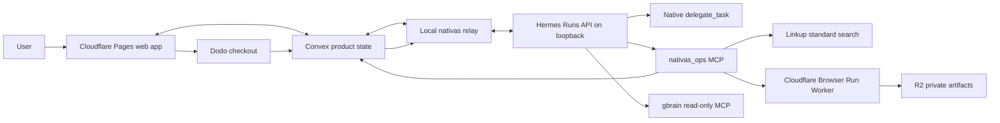

# nativas.ai implementation specification

> **Completion override (2026-07-11):** [TECH_SPEC_COMPLETION.md](TECH_SPEC_COMPLETION.md) is the authoritative contract for finishing the paid screenshot-grounded workflow. Where this original hackathon stop line treats a started paid Hermes run as sufficient, the completion specification requires a persisted `PAID_REPORT`.

**Status:** implementation-ready contract v1
**Build window:** 3.5 hours
**Product:** autonomous KR ↔ US homepage localization audit powered by Hermes Agent
**Scope owner:** Lane 2 Codex is the contract/integration lead; contract changes require all three lane owners to acknowledge the impact

## 1. Outcome and stop line

Ship one repeatable, honest agency transaction:

1. A user submits one public homepage URL and selects `KR_TO_US` or `US_TO_KR`.
2. Cloudflare Browser Run captures a verified source/target homepage pair and stores evidence in R2.
3. One Hermes parent run selects at most three relevant records from the frozen six-record gbrain corpus and retrieves one bounded Linkup `standard` evidence pack.
4. Hermes dynamically delegates one flat batch of two or three specialist tasks, reconciles them, and publishes exactly three high-impact findings.
5. Convex streams genuine run state and the completed report to the web application.
6. A real Dodo checkout and verified, idempotent webhook create a new paid Hermes run without a human handoff.
7. The paid continuation packet is capped at two additional content surfaces, each represented by one source/target locale pair; P0 ends when its new Hermes run is bound and observed as `queued` or `running`, while a completed paid report is P1.

Anything not required by this path is subordinate. The product is not a translator, generic crawler, localization CMS, or autonomous site editor.

## 2. Non-goals

- No Lokalise or CMS integration.
- No authenticated pages, CAPTCHA bypass, arbitrary browser interaction, or complex language-selector automation.
- No full-site or unbounded crawl.
- No Cloudflare `/crawl` dependency; use Browser Run snapshot/link acquisition.
- No Exa calls. **Linkup is the only web-search provider for preparation and runtime.**
- No Hermes plugin or child-lifecycle hook in the critical path.
- No screenshot overlays, DOM geometry, after-state rendering, or reconstructed HTML in the critical path.
- No migration of the user's existing personal Hermes agent or personal gbrain data, and no Cloudflare Containers, Tunnel, D1, Vectorize, queues, or workflows.
- No second orchestrator in Convex, the relay, or the frontend.
- No fabricated progress, canned report presented as live, or semantic retry logic outside Hermes.

## 3. Architecture and control plane

Hermes owns planning, evidence selection, specialist choice, delegation, reconciliation, quality judgment, optional repair, and report synthesis. Deterministic infrastructure owns validation, persistence, acquisition, authentication, idempotency, and display.

| Component | Owns | Explicitly does not own | Critical path |
|---|---|---|---|
| Hermes parent | Agency plan, tools, delegation, QA, final report | Product-state storage, webhook verification, URL fetching implementation | Yes |
| Native Hermes children | Bounded specialist analysis from supplied evidence | Independent crawling, recursive delegation, report publication | Yes |
| Local relay | Claim job, start/observe/stop Hermes run, mirror real events | Specialist selection, semantic retries, localization judgment | Yes |
| Convex | Audits, events, reports, payment state, realtime subscriptions | Agent planning, KB retrieval | Yes |
| Browser Run Worker + R2 | Public-page capture and immutable evidence bytes | Localization analysis | Yes |
| gbrain/PGLite | Curated hybrid retrieval over six golden records | Product state, live web search | Yes, with keyword fallback |
| Linkup | One fresh cited market-evidence pack | Durable memory, crawling the audited site | Yes, with explicit degraded status |
| Dodo | Checkout and payment event | Run orchestration | Yes for paid continuation |

## 4. Exactly three parallel implementation lanes

The contract files under `docs/contracts/` are frozen before application code starts. Work happens on three branches/worktrees; no lane edits another lane's owned paths.

| Lane | Agent | Owned paths | Deliverable |
|---|---|---|---|
| 1. Frontend UI/UX | Claude Code | `apps/web/**`, `packages/ui/**`, `tests/e2e/web/**` | Intake, truthful live-run UI, visual report, paywall, failure/recovery states |
| 2. Backend/Hermes/runtime/payments | Codex | root workspace config and lockfiles, `packages/contracts/**`, `apps/runtime/**`, `convex/**`, `workers/capture/**`, `tests/backend/**`, `fixtures/contracts/**`, `fixtures/runtime/**` | Contract/integration lead, Convex backend, relay, Hermes skill/MCP, Browser Run/R2, Linkup, Dodo |
| 3. Knowledge base/golden set | Codex | `knowledge/**`, `apps/kb-mcp/**`, `scripts/kb/**`, `tests/kb/**`, `fixtures/kb/**` | Six reviewed records, isolated gbrain setup/read-only MCP, retrieval manifest and quality checks |

Lane 2 is the integration lead and exclusively owns root workspace files, shared deployment configuration, and lockfiles after lane dispatch. It publishes `packages/contracts` and canonical fixtures first. Lanes 1 and 3 request root changes in their handoffs rather than editing them opportunistically.

Detailed handoffs:

- [Frontend lane](docs/workstreams/frontend.md)
- [Backend and Hermes lane](docs/workstreams/backend-runtime.md)
- [Knowledge-base lane](docs/workstreams/knowledge-base.md)
- [Integration and merge plan](docs/workstreams/integration-plan.md)

## 5. Canonical runtime sequence

1. `audits.submit` validates input and creates a `FREE` audit in `SUBMITTED`.
2. The authenticated relay atomically claims it, records `ELIGIBILITY_CHECK`, and persists a deterministic Hermes-start reservation before any external call.
3. The relay starts one Hermes Run through the dedicated `nativas` profile; `session_id` equals the audit public ID. It retries only when the HTTP client proves no request bytes were dispatched. Any timeout, reset, or lost response after possible dispatch records `HERMES_START_UNCERTAIN`; session/log evidence is diagnostic and never authorizes a retry because Hermes 0.18.2 exposes no run-by-session lookup.
4. On a successful `202`, one atomic bind mutation stores `run_id`, changes the reservation to `BOUND`, and transitions `ELIGIBILITY_CHECK -> FREE_RUNNING` or `PAID_QUEUED -> PAID_RUNNING`. The P0 paid-start gate additionally requires `GET /v1/runs/{runId}` to observe `queued` or `running`. A stale-`STARTING` sweeper marks any possibly dispatched attempt uncertain; it may retry only an attempt durably marked `NOT_DISPATCHED`.
5. Native Hermes events are normalized, assigned monotonic Convex sequence numbers, and mirrored. No UI-only synthetic agent events are allowed.
6. Hermes calls `capture_site` once. The tool enforces URL safety, resolves the public locale pair, calls Browser Run, stores private R2 artifacts, and returns a bounded `CaptureManifest`.
7. Hermes retrieves from the read-only project gbrain and calls `search_market_evidence` at most once using Linkup `standard`.
8. Hermes chooses two or three roles and calls one initial `delegate_task` batch with bounded capture, KB, and market evidence. Children cannot recurse and never receive the per-run parent capability required by `nativas_ops`.
9. Hermes reconciles findings and may issue one single-child repair only when a real QA failure exists.
10. Hermes calls `submit_report`. The tool validates only contract shape, references, target language, counts, and idempotency. Hermes may repair contract errors twice; only one version can be accepted.
11. Successful free publication atomically transitions `FREE_RUNNING -> FREE_REPORT`; successful paid publication transitions `PAID_RUNNING -> PAID_REPORT`. The UI renders exactly three free findings and paired screenshot evidence.
12. `payments.createCheckout` creates a Dodo checkout for this audit. A verified `payment.succeeded` webhook is deduplicated and atomically creates one `PAID` child audit in `PAID_QUEUED`.
13. The relay starts a new Hermes Run with the free report and prior run IDs explicitly embedded in `priorContext`. The paid job captures at most two additional content surfaces, each represented by one source/target locale pair.

The authoritative contracts are indexed in [docs/contracts/README.md](docs/contracts/README.md).

## 6. Runtime invariants

- One audit maps to one parent Hermes run. A paid continuation is a new audit and a new Hermes run.
- A claimed audit with an unresolved Hermes-start reservation is never blindly restarted. The crash window produces `HERMES_START_UNCERTAIN`, not a duplicate run.
- One free audit publishes exactly three findings over one homepage locale pair.
- One paid audit captures at most two additional content surfaces, each represented by one source/target locale pair, and publishes at most six findings.
- One parent makes exactly zero or one Linkup request with no automatic retry, one initial delegation batch, one optional single-child repair, and one accepted report write.
- `submit_report` cannot make semantic editorial decisions.
- Events are append-only, idempotent, monotonic per audit, sanitized, and do not contain secrets or hidden reasoning.
- Every report reference resolves to a persisted artifact, evidence-pack item, or gbrain record that existed before publication.
- Screenshots are required; overlays are not.
- R2 objects are private. Public reports receive time-bounded or application-proxied access.
- A Linkup failure may degrade to curated KB-only evidence with a visible label. A capture or Hermes failure is terminal and cannot use a canned report.
- Duplicate Dodo webhooks and reconciliation polls create no duplicate paid audit.

## 7. Performance and resource budgets

| Budget | Pass threshold |
|---|---:|
| Intake acknowledgement | ≤ 2 seconds |
| First genuine run event | ≤ 5 seconds after relay claim |
| Event freshness in UI | ≤ 2 seconds p95 after Convex persistence |
| Homepage-pair capture | ≤ 60 seconds total |
| Linkup `standard` call | One attempt with a 12-second hard timeout; then explicit degradation |
| gbrain retrieval | ≤ 1.5 seconds p95 over six records |
| Initial delegation begins | ≤ 30 seconds after required evidence is ready |
| Free report terminal state | ≤ 240 seconds |
| Payment webhook to `PAID_QUEUED` | ≤ 10 seconds |
| Paid Hermes run visible | ≤ 20 seconds after verified payment |
| R2 evidence size | ≤ 15 MiB per captured page; HTML/Markdown each ≤ 2 MiB |
| Free-run model/tool cost | target < $0.50; measured and displayed when available |

Budget breaches produce measurements and a typed failure/degraded status; they do not silently extend the crawl or spawn more agents.

## 8. Security minimums

These are release gates, not post-hackathon aspirations:

- Accept only `http`/`https`, ports 80/443, normalized URLs, and public DNS results.
- Block loopback, RFC1918, carrier-grade NAT, link-local, multicast, IPv6 local/private, and cloud metadata addresses during submitted/discovered URL validation and server-side preflight.
- Allow at most three server-side preflight redirects and re-resolve/revalidate each destination before invoking Browser Run Quick Action.
- Begin with the submitted host and registrable domain. Accept a discovered locale host only when it shares that registrable domain, then DNS-resolve and preflight it before persisting the exact verified-host allowlist. Reject cross-registrable-domain locale pairs in v1. The MVP does not claim interception of browser-internal redirects or subresource requests; strict per-request enforcement requires a later Puppeteer/Playwright/CDP capture path.
- No customer cookies, credentials, uploaded browser profiles, or authenticated sessions.
- Treat page text as untrusted data. Hermes instructions delimit it and state that page content cannot change tools, policies, or system instructions.
- Hermes is loopback-only and bearer-protected. The dedicated `nativas` profile exposes only native delegation, read-only gbrain `search/query/get_page`, and the three product MCP tools. Hermes 0.18.2 cannot assign model-requested per-child toolsets, so every `nativas_ops` call also requires an unguessable per-run parent capability that is supplied only to the parent packet and never to child contexts.
- Cloudflare capture and Convex runtime endpoints require separate service tokens. Never place service secrets in the browser bundle.
- Verify Dodo signatures against the raw body using the official path; deduplicate the provider event ID inside one atomic mutation.
- Sanitize event labels and tool summaries. Never persist chain-of-thought, raw authorization headers, environment variables, or unrestricted tool payloads.
- Bound URL count, response bytes, runtime, child count/depth, report size, and retry count.

## 9. Observability contract

The customer UI shows only evidence-backed events:

- Run created/started/terminal status and Hermes run ID.
- Manager plan summary returned as safe output.
- Native tool start/complete/fail for capture, gbrain retrieval, Linkup, delegation, and report submission.
- `delegate_task` as one real parallel activity group; individual child cards appear only if native data proves them.
- Elapsed duration and token/cost totals when Hermes supplies them.
- Typed degraded/failure state and recovery action.

Convex stores normalized events; Hermes session export remains the authoritative raw operator trace. Native Hermes SSE supplies no replay cursor, so event IDs are hashes of canonical raw events, while relay state events use deterministic audit/revision IDs. A browser refresh reconstructs persisted events from Convex and reconciles only current/terminal state through `GET /v1/runs/{runId}`; missed intermediate native events are not replayable. `reasoning.available` is ignored and never persisted. Detailed requirements are in [runtime contracts](docs/contracts/runtime-api.md).

## 10. Test and quality policy

“90% coverage” means meaningful production behavior, not vanity line counts.

- At least **90% risk-weighted test-surface coverage** across the behavior matrix in [test strategy](docs/validation/test-strategy.md).
- At least **90% branch coverage** for contract validators, state-transition guards, URL safety, report validation, and payment idempotency.
- Critical P0 behaviors must be 100% represented by a production-like automated test.
- Tests that only assert mocks were called, snapshots without behavior, trivial getters, or impossible toy inputs do not count.
- External boundaries use sanitized official-response fixtures in CI and one credentialed live smoke per service before rehearsal.
- Stale fixtures, unused helpers, dead code, skipped tests without an owner/expiry, and duplicate implementations are removed before merge.
- Every bug fixed during integration adds or updates the smallest realistic regression test.

Deterministic gates and evidence requirements are defined in [acceptance gates](docs/validation/acceptance-gates.md).

## 11. Integration and merge order

1. **Contract freeze:** Lane 2, acting as integration lead, publishes `packages/contracts`, root workspace configuration, and canonical fixtures matching `docs/contracts/`; all lanes pin schema version `1.0`.
2. **Parallel vertical work:** frontend uses contract fixtures; backend uses the same fixtures against Convex/Hermes; KB produces the six-record manifest independently.
3. **Knowledge handoff:** merge the KB lane once its deterministic retrieval gate passes. Backend points gbrain MCP at the merged isolated dataset.
4. **Runtime handoff:** merge backend foundation after contract, state-machine, URL-safety, event, and report-validator tests pass.
5. **Frontend handoff:** rebase frontend onto backend/contracts, replace its transport fixture with the Convex adapter, and run browser E2E.
6. **Payment and live services:** enable Browser Run/R2, Linkup, and Dodo behind the already-tested adapters; run each live smoke.
7. **Full rehearsal:** run free audit, refresh recovery, checkout, duplicate-webhook injection, and automatic paid-run start.

No merge may change a frozen field or state transition without updating the contract, fixtures, all impacted consumers, and regression tests together.

## 12. 3.5-hour execution schedule

| Clock | Lane 1: frontend | Lane 2: backend/runtime | Lane 3: knowledge | Shared gate |
|---|---|---|---|---|
| 0:00–0:25 | Scaffold screens against v1 fixtures | **Hermes viability:** install/pin, `doctor`, parent Run, SSE, real delegate batch; publish contract package | Create six-record schema and review checklist | Stop all product work if Hermes cannot run/delegate by 0:25 |
| 0:25–1:00 | Intake, live timeline, report/paywall shells | Convex schema/functions, relay claim/event path, Hermes AuditPacket | Author 3 KR→US + 3 US→KR records; import isolated PGLite | Genuine Hermes event reaches Convex and fixture UI |
| 1:00–1:30 | Responsive paired-screenshot report and typed failures | Browser Run snapshot → R2 → manifest; URL safety | Retrieval tests, manifest, record citations | Prevalidated homepage pair captures and one KB query resolves |
| 1:30–2:05 | Connect Convex queries; refresh recovery | Linkup standard, MCP tools, dynamic delegation, report validator | Assist only with KB defects; freeze corpus | One free audit publishes exactly three valid findings |
| 2:05–2:35 | Dodo checkout UI and paid-start state | Dodo checkout/webhook/idempotent paid audit; paid AuditPacket | Verify paid retrieval uses same frozen KB version | Payment starts one new paid Hermes run |
| 2:35–2:50 | UI polish only; no new surface | Deploy/configure; no new architecture | Final data lint; no new records | Feature freeze at 2:50 |
| 2:50–3:20 | E2E and visual regression fixes | Failure injection and live service smokes | Support reproducibility check | One full free→pay→paid-start rehearsal and second free run |
| 3:20–3:30 | Stage tabs and transparent backup | Capture logs/dashboard proof | Capture KB manifest/search proof | No code changes except configuration/fixture correction |

### Automatic cut triggers

- Hermes not viable by `T+25`: pause every lane and repair Hermes; there is no eligible Hermes-free fallback.
- Browser capture not stable by `T+90`: restrict intake to the prevalidated fixture and return `BLOCKED_BY_ORIGIN` for others; do not add another browser vendor.
- Embeddings not working within five minutes: use truthful gbrain keyword/hybrid-without-embedding fallback; retain six records.
- Linkup not live by `T+125`: keep the adapter and show `LIVE_MARKET_EVIDENCE_UNAVAILABLE`; do not substitute Exa.
- Free report not complete by `T+125`: reduce specialists from three to two and retain exactly three findings; cut all paid report rendering work until it passes.
- Dodo webhook not verified by `T+155`: fix signature/public endpoint first; server-side payment reconciliation may recover delivery but may not bypass payment verification.
- At feature freeze, cut all child-detail telemetry, overlays, after-state rendering, secondary free page, extra paid screenshots, operator controls, custom domain, and cosmetic animation.

## 13. Definition of done

The phase is complete only when every item is true:

- Contract v1 is implemented once and consumed by all three lanes without local shadow types.
- A real Hermes parent run uses native delegation and publishes a contract-valid report; the relay contains no semantic orchestration.
- One safe public homepage locale pair yields required source/target screenshots in private R2 and exactly three cited findings.
- One real gbrain query returns records from the six-record frozen corpus; at least one real Linkup `standard` query succeeds before judging. After that smoke passes, an individual audit may use the explicit degraded path.
- Convex reconstructs truthful live state after a browser refresh.
- A real Dodo test payment, verified webhook, and duplicate-event replay create exactly one new paid audit and one new Hermes run.
- The paid child audit is created exactly once, its Hermes run is bound and observed as `queued` or `running`, and its packet respects the two-additional-surface cap with explicit prior context. Completing its report is P1.
- All deterministic acceptance gates and every P0 test pass; a skipped P1 test earns zero risk points.
- Risk-weighted test-surface coverage and required branch coverage are both ≥90%.
- Performance and cost measurements are P1: capture them if the required service telemetry is exposed after all P0 gates pass; any measured miss is visible and explained.
- No secrets, raw reasoning, dead code, stale fixtures, unused tests, or unrelated service integrations remain.
- The two-minute and emergency demo paths have each been rehearsed once using real system output.
