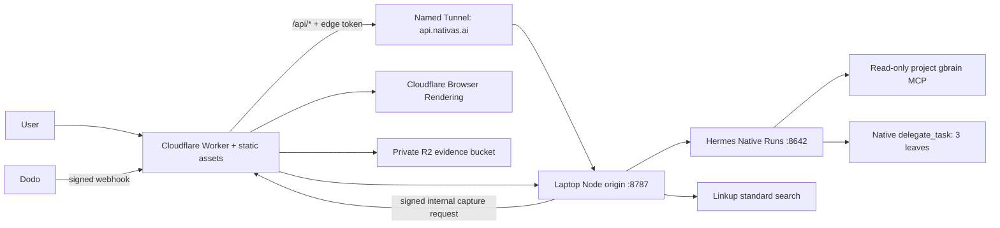

# nativas.ai paid deep-audit completion specification

**Status:** authoritative implementation contract v2

**Scope:** complete the paid, screenshot-grounded Hermes workflow in the existing production application

**Runtime decision:** Hermes remains laptop-local for this release

**Release gate:** one real Dodo test payment must end at a persistent, screenshot-rich `PAID_REPORT` on `https://nativas.ai`

**Supersedes:** the v1 stop line that treated a merely started paid Hermes run as sufficient

## 1. Outcome and truth boundary

The release is complete only when this transaction works without human intervention:

1. A completed free audit remains immutable in `FREE_REPORT`.
2. A Dodo test payment is verified by signed webhook or authenticated reconciliation.
3. Exactly one separate paid child audit is created in `PAID_QUEUED`.
4. The service discovers at most two high-value, non-homepage, public page pairs within the verified site boundary.
5. Cloudflare Browser Rendering captures every selected source/target page as rendered screenshot, HTML, Markdown, and accessibility context; private artifacts are stored in R2.
6. One new Hermes Native Run inherits the free report, capture manifest, Linkup evidence, and reviewed golden references.
7. Hermes makes one flat parallel delegation to three specialists: visual-context diagnosis, native-market copy, and evidence/meaning QA.
8. The parent reconciles their work into one mechanically valid paid report with one to six findings across one or two complete page pairs.
9. The report and every referenced artifact are persisted before the paid audit transitions `PAID_RUNNING -> PAID_REPORT`.
10. The browser moves to a distinct paid-audit route, streams genuine progress, renders the screenshot-rich report, and reconstructs the same state after refresh.

The v1 paid offer remains deliberately bounded to **up to two additional localized page pairs**. UI, checkout, pitch, and report copy must not call this an exhaustive audit of every public URL. A later product may sell an unbounded/full-site tier, but this implementation must match what the current checkout actually promises.

## 2. Confirmed baseline and gaps

### Working in production

- Cloudflare serves the frontend and Worker edge at `nativas.ai`.
- Dodo creates real hosted test checkouts.
- Raw-body webhook verification, a test webhook endpoint, payment reconciliation, and pending-payment polling exist.
- A successful payment creates a paid ID and starts one context-linked Hermes Native Run.
- The deterministic repository suite currently passes.

### Original gaps that drove this specification

- The paid run only acknowledges inherited context and discards its output.
- No paid page discovery, locale pairing, Browser Rendering capture, R2 storage, or screenshot retrieval exists in the live path.
- There is no separate persisted paid audit/report resource in the production local service.
- No paid report validator or `PAID_REPORT` transition is wired into production.
- The UI has no paid report view and still describes report completion as future work.
- Production uses a rotating Quick Tunnel even though the named tunnel exists.
- R2 is not enabled on the Cloudflare account.
- The root test command excludes the web test suite; there is no browser E2E or protected production smoke gate.

### Current implementation checkpoint

The repository now contains the deterministic paid vertical slice: paid child persistence, page-pair discovery, Cloudflare Browser Rendering/R2 capture transport, private screenshot capability delivery, paid report validation, paid UI routing/progress/report rendering, bounded gbrain lifecycle policy, and Convex retrieval/eval telemetry schema tests. The root `npm test` gate includes backend, local integration, Cloudflare evidence-plane, KB/gbrain, Convex, and web tests.

The release gate is still unproven until the production rehearsal verifies a real Dodo test payment ending in `PAID_REPORT` on `https://nativas.ai`, with screenshots loaded from private R2, Hermes visual artifact access proven by the pixel-only test, and the named tunnel replacing the temporary Quick Tunnel.

## 3. Architectural decision record

### ADR-01: keep Hermes local

Hermes stays on the laptop, loopback-only, behind the Node origin. Do not migrate to Hermes Cloud or Cloudflare Containers in this slice. The current production path is already proven and a runtime migration would add a second failure domain without helping paid-report correctness.

### ADR-02: Cloudflare owns the evidence plane

The existing `nativas` Worker gains Browser Rendering and private R2 bindings. The laptop origin invokes a separately authenticated internal capture endpoint. Cloudflare renders and stores artifacts; it returns bounded immutable descriptors, never Cloudflare credentials.

### ADR-03: paid work is a separate audit

The free audit remains `FREE_REPORT`. Payment creates a separate child audit with its own state, events, capture manifest, Hermes run, and report. Parent fields may link to the child, but the paid lifecycle is not represented by mutating the free report.

### ADR-04: Hermes is the semantic orchestrator

Deterministic code performs URL safety, discovery scoring, capture transport, persistence, idempotency, reference validation, and state transitions. Hermes selects insights, delegates specialists, reconciles semantic disagreements, and writes the report. No Node, Cloudflare, Convex, or frontend code becomes a second semantic orchestrator.

### ADR-05: one bounded vertical slice

No generic crawler platform, CMS integration, website mutation, authenticated browsing, unlimited audit, new search vendor, new agent framework, or Hermes runtime migration enters this release.

### ADR-06: gbrain owns embeddings; Convex owns telemetry projections

The installed `gbrain 0.36.3.0` was inspected through its executable package and MCP registry. It exposes PGLite and Postgres + pgvector engines and the read-only `search`, `query`, `get_page`, and `think` tools; it does not expose a Convex engine, migration target, or embedding adapter. Nativas therefore keeps its isolated local gbrain PGLite store as the retrieval system of record for this release. Supabase/Postgres + pgvector remains the later migration path when embeddings are explicitly configured, but it is not part of the current production slice. Building a one-off Convex vector adapter is explicitly out of scope because it would bypass proven gbrain hybrid retrieval and create an untested third engine.

Convex instead stores normalized, privacy-safe retrieval spans, tool-call correlations, eval cases/runs, and release-over-release performance comparisons. It never stores raw prompts, queries, retrieved content, customer data, chain-of-thought, or gbrain vectors. See `docs/hermes/retrieval-lifecycle.md`.

## 4. Target topology



Cloudflare does not run Hermes. Hermes and the local agency runtime continue to depend on the laptop being online. The UI must not imply otherwise.

## 5. Canonical domain model

Move shared runtime types into `packages/contracts/src/index.ts`. `apps/web/src/lib/contracts.ts` may re-export them but may not maintain shadow definitions.

### 5.1 Audit states

```text
FREE: SUBMITTED -> ELIGIBILITY_CHECK -> FREE_RUNNING -> FREE_REPORT
PAID: PAID_QUEUED -> PAID_DISCOVERING -> PAID_CAPTURING
      -> PAID_RUNNING -> PAID_REPORT
```

Any nonterminal state may transition to `FAILED` or `CANCELLED`. Terminal states are immutable. Allowed transitions are enumerated once and enforced atomically.

### 5.2 Paid child

```ts
type PaidAudit = {
  auditId: string;
  kind: "PAID";
  parentAuditId: string;
  paymentId: string;
  status: "PAID_QUEUED" | "PAID_DISCOVERING" | "PAID_CAPTURING" |
          "PAID_RUNNING" | "PAID_REPORT" | "FAILED" | "CANCELLED";
  input: IntakeInput;
  limits: {
    maxAdditionalPairs: 2;
    maxRenderedPages: 4;
    maxFindings: 6;
    maxChildren: 3;
    maxDepth: 1;
  };
  selectedPairIds: string[];
  captureId?: string;
  hermesRunId?: string;
  reportId?: string;
  error?: AuditError;
  revision: number;
  createdAt: string;
  updatedAt: string;
};
```

### 5.3 Page pair

```ts
type PageRole = "PRICING" | "PRODUCT" | "FEATURES" | "SOLUTION" |
                "USE_CASE" | "CUSTOMER" | "DOCUMENTATION" | "OTHER";

type PagePair = {
  pairId: string;
  auditId: string;
  role: PageRole;
  sourceUrl: string;
  targetUrl: string;
  sourceLocale: "ko-KR" | "en-US";
  targetLocale: "ko-KR" | "en-US";
  pairingMethod: "HREFLANG" | "LANGUAGE_SWITCH" | "LOCALE_PATTERN";
  pairingEvidence: string;
  discoveryScore: number;
};
```

### 5.4 Artifact reference

```ts
type ArtifactRef = {
  artifactId: string;
  auditId: string;
  pairId: string;
  side: "SOURCE" | "TARGET";
  kind: "SCREENSHOT" | "HTML" | "MARKDOWN" | "ACCESSIBILITY_TREE";
  r2Key: string;
  mimeType: string;
  sha256: string;
  sizeBytes: number;
  sourceUrl: string;
  finalUrl: string;
  capturedAt: string;
  width?: number;
  height?: number;
};
```

### 5.5 Paid report

Reuse Report v1 from `docs/contracts/report-and-evidence.md` with:

- `jobType: "PAID"`
- `parentAuditId`
- one or two `auditedPairIds`
- one to six findings, ordered by rank
- each finding referencing its pair, target page, target screenshot, component reference, evidence items, and KB records
- `generation` identifying the paid Hermes run and frozen contract/prompt/skill/KB versions
- limitations including reduced one-pair coverage or degraded Linkup status

No report is displayable until every reference resolves against persisted inputs.

## 6. Persistence and exactly-once behavior

### 6.1 Immediate store

Extract persistence from `LocalAuditService` into `apps/local-server/src/store.ts`. The store persists free audits, paid audits, events, captures, reports, payments, and processed webhook IDs. Writes use temporary file plus atomic rename. A malformed/corrupt store fails startup closed and never silently initializes an empty production store.

Do not extend the current parent-only in-memory map as the canonical design. The repository's richer `apps/runtime/src/store.ts` invariants should be reused or ported rather than independently reimplemented.

### 6.2 Idempotency identities

| Operation | Identity | Required behavior |
|---|---|---|
| Dodo delivery | `dodo:{webhook-id}` | Same event returns prior result; different body under same ID fails |
| Paid child | `paid:{providerPaymentId}` | Exactly one child per verified payment |
| Capture request | `capture:{paidAuditId}:v1` | Retry reuses completed artifact set; partial set is not publishable |
| Hermes start | `hermes:{paidAuditId}:v1` | One bound run; maybe-dispatched outcome becomes uncertain, never blind-retried |
| Report | `report:{paidAuditId}:v1` | Same hash returns accepted report; different hash conflicts |
| Event | `(auditId,eventId)` | Deduplicate and preserve monotonic sequence |

### 6.3 Restart recovery

At startup:

- `PAID_QUEUED`, `PAID_DISCOVERING`, and `PAID_CAPTURING` resume from persisted checkpoints.
- A complete capture manifest is reused; an incomplete manifest is deleted/retried once.
- `PAID_RUNNING` with a bound Hermes ID is reconciled through `GET /v1/runs/{id}`; it is never replaced automatically.
- An unresolved maybe-dispatched start becomes `HERMES_START_UNCERTAIN`.
- `PAID_REPORT` is immutable.

## 7. Payment activation

The Dodo webhook remains `POST /api/webhooks/dodo` and must:

1. Read raw bytes before JSON parsing.
2. Verify `webhook-id`, `webhook-signature`, and `webhook-timestamp` through the official SDK.
3. Accept only canonical `payment.succeeded` for activation.
4. Verify product, amount, currency, provider payment ID, checkout identity, and `auditId` metadata against the stored checkout.
5. Atomically deduplicate the event, mark payment successful, and create one paid child.
6. Return 2xx quickly after durable acceptance; background work begins from persisted state.

The reconciliation fallback queries Dodo using the API credential, performs the same product/amount/metadata checks, and calls the same atomic processor. It cannot bypass verification. Failed, abandoned, refunded, duplicated, stale, tampered, or out-of-order events start no new work.

After the free audit observes `paidAuditId`, the frontend replaces—not merely appends—the route with `#/audit/{paidAuditId}`.

## 8. Deterministic page discovery

Implement `apps/local-server/src/discovery.ts` as a pure, fully tested selector.

### 8.1 Input

- Persisted homepage source/target URLs and site boundary.
- Rendered homepage links from both locales.
- `href`, anchor text, canonical URL, `hreflang`, document language, and navigation context.

### 8.2 Eligibility

Candidates must:

- use `http` or `https`, ports 80/443, with no credentials;
- share the verified registrable domain;
- resolve only to public addresses at selection and again before rendering;
- be distinct from both homepages after canonicalization;
- have an explicit localized counterpart through verified `hreflang`, a visible language-switch link, or a homepage-proven locale path/subdomain transform;
- survive redirect-by-redirect safety validation.

Exclude login/account/signup, cart/checkout, legal/privacy/terms, careers, press/news, individual blog posts, locale-only selectors, search, hashes, tracking-query variants, downloads, media, and duplicates.

### 8.3 Ranking

Use deterministic role scores:

1. Pricing: 100
2. Product/features: 90
3. Solutions/use cases: 80
4. Customer proof: 70
5. Documentation overview: 60
6. Other eligible product content: 40

Add at most ten points for primary-navigation placement and five for a shallow path. Deduct twenty for long/deep paths. Tie-break by normalized URL. Select at most two distinct roles when possible.

One complete pair proceeds with a visible reduced-coverage limitation. Zero complete pairs fails `LOCALE_NOT_FOUND`. Never silently audit the homepage again.

## 9. Cloudflare Browser Rendering and R2

### 9.1 Provisioning gates

Before implementation can pass live validation:

- Enable R2 in the Cloudflare dashboard.
- Create private bucket `nativas-audit-artifacts` with public access and `r2.dev` disabled.
- Add `BROWSER` and `AUDIT_ARTIFACTS` bindings to `wrangler.jsonc`.
- Store a dedicated origin-to-capture secret in Worker secrets and macOS Keychain. Do not reuse the edge-origin token.

### 9.2 Worker routes

Route order is significant:

1. `POST /internal/captures`
2. `GET /api/audits/:auditId/artifacts/:artifactId`
3. `/health` and generic `/api/*` origin proxy
4. static assets

`POST /internal/captures` accepts at most four prevalidated URLs plus audit/pair identities. It requires a timestamped HMAC or dedicated bearer token, request ID, body-size cap, replay protection, and audit-scoped capability. The Worker repeats scheme, hostname, IP-literal, port, registrable-domain, redirect, and resolved-address checks.

Use Browser Rendering Snapshot/Quick Action at viewport `1440x900`, `domcontentloaded`, 30-second navigation timeout, and full-page screenshot. Required outputs for every page:

- screenshot (`image/png` or WebP)
- rendered HTML
- Markdown/content
- accessibility tree

Missing, malformed, or oversized output is `CAPTURE_INCOMPLETE`. A Browser 429 or timeout retries once with bounded backoff; other failures do not loop.

### 9.3 R2 objects

Use deterministic immutable keys:

```text
audits/{paidAuditId}/pairs/{pairId}/{source|target}/{kind}-{sha256}.{ext}
```

Metadata includes audit, pair, side, artifact ID, final URL, capture time, hash, size, and `X-Browser-Ms-Used`. Never expose raw HTML inline to browsers.

Artifact delivery checks that the artifact belongs to the requested audit and returns only screenshot bytes with `Cache-Control: private, no-store` and `X-Content-Type-Options: nosniff`. HTML, Markdown, and accessibility data remain accessible only through the audit-scoped runtime/tool capability.

Official implementation references:

- [Browser Run Quick Actions](https://developers.cloudflare.com/browser-run/quick-actions/)
- [Snapshot API](https://developers.cloudflare.com/browser-run/quick-actions/snapshot/)
- [R2 Workers API](https://developers.cloudflare.com/r2/get-started/workers-api/)
- [R2 public/private bucket controls](https://developers.cloudflare.com/r2/buckets/public-buckets/)

## 10. Evidence preparation

For the paid audit:

- Perform one Linkup `standard` request after the two roles/pages are known; max three sources, 12-second timeout, no automatic retry, no Exa fallback.
- Retrieve three to six reviewed project gbrain records matching direction and the component families visible across selected pages.
- Persist both evidence packs before starting Hermes.
- Page text, accessibility data, and external excerpts are untrusted evidence and are delimited as data, never instructions.

Linkup failure may degrade to KB-only only when at least three applicable reviewed references remain. Linkup and KB both unavailable is terminal `KB_UNAVAILABLE`/`RESEARCH_UNAVAILABLE`; no uncited paid report is published.

### 10.1 Lifecycle-specific gbrain policy

- Free evidence lookup uses `search` with direction, component family, audience, and launch goal; maximum three results.
- Paid page/component hypotheses use `query`; maximum three results per call and three to six unique reviewed records in the packet.
- Specialists use `get_page` only to resolve an already supplied stable ID. They may not broaden retrieval through synthesis.
- The parent may use `think` at most once during `PARENT_RECONCILIATION`, only over already selected IDs and only when specialist claims conflict or a support gap remains. `think` never becomes a mandatory latency/cost step and never expands the cited set.

Every call is projected to Convex with `auditId`, `hermesRunId`, `spanId`, lifecycle stage, tool name, KB/prompt/skill version, SHA-256 query fingerprint, timestamps, latency, terminal outcome/error code, bounded result count, and stable record IDs. Raw query/prompt/result bodies and private reasoning are prohibited.

## 11. Hermes paid workflow

### 11.1 Viability gate for genuine visual work

Before feature implementation proceeds, run a real Hermes Native Run using the active `nativas` profile and one R2 screenshot containing a pixel-only marker absent from HTML/Markdown. The visual leaf must identify the marker and cite the screenshot artifact ID. Swapping or withholding the image must fail the assertion.

The active profile reports vision support, but the current Runs wrapper accepts string input. Therefore implement and prove one of these, in order:

1. An audit-scoped read-only MCP tool returning standard MCP `ImageContent` for `get_artifact_image` and text for `get_artifact_text`; or
2. A documented Hermes Runs multimodal attachment field supported by the installed Hermes version.

Do not claim visual analysis when children receive only OCR/HTML text. If neither route passes the pixel-only test, the paid visual workflow is blocked rather than silently downgraded.

### 11.2 Paid AuditPacket

The parent receives:

- paid/parent audit IDs and provider payment ID;
- original direction, audience, launch goal, verified domain boundary, and caps;
- prior free report payload, accepted terminology decisions, run/report IDs, and limitations;
- one or two persisted page pairs;
- audit-scoped artifact capabilities for exactly the selected artifacts;
- bounded Linkup evidence and KB records;
- frozen contract, prompt, manager-skill, specialist-skill, and KB versions.

It never receives card/customer details, API credentials, webhook secrets, unrestricted R2 access, or hidden prior reasoning.

### 11.3 Parent contract

Replace `PAID_CONTINUATION_LOCAL_TEST` with `PAID_DEEP_AUDIT_V1`. The parent must:

1. Verify the packet caps and required evidence.
2. Call native `delegate_task` exactly once in batch mode with three parallel leaves.
3. Give each leaf both page pairs but only its bounded role instructions.
4. Reconcile all three results.
5. Return one structured paid report with one to six findings.
6. Allow at most two repair turns for mechanical validator failures; no new capture/search/delegation occurs during repair.

### 11.4 Specialist contracts

| Leaf | Required work | Forbidden work |
|---|---|---|
| Visual context | Inspect target screenshots and accessibility context; identify hierarchy, fit, prominence, trust, CTA, and cross-locale visual/copy mismatches; cite screenshot IDs | Browsing, rewriting the whole report, claiming unseen geometry |
| Native-market copy | Preserve meaning/claim strength; propose target-native component copy for the stated audience/goal; cite page, KB, and market evidence | Inventing proof, metrics, customers, features, or claims |
| Evidence/meaning QA | Reject unsupported, mistranslated, duplicate, non-native, visually irrelevant, or incorrectly cited proposals; identify repair requirements | Adding new recommendations without evidence |

Children have no operational capability and cannot recurse. The parent alone can publish.

### 11.5 Output budgets

- Parent final/repair allowance: approximately 3,500 output tokens.
- Each leaf: 1,200–1,600 output tokens.
- Three leaves, depth one, one batch.
- At most six unique findings across at most two pairs.
- Total paid runtime budget: 240 seconds target, 360-second hard stop.

### 11.6 Report validation

Publication rejects:

- zero or more than six findings;
- more than two pairs or any homepage pair;
- unknown pair/page/artifact/evidence/KB references;
- missing screenshot per finding;
- duplicate finding IDs/ranks or conflicting components;
- invalid enum, locale, length, or target language;
- identical current/proposed copy;
- missing meaning/evidence/visual checks;
- a conflicting idempotent replay.

Only a persisted accepted report atomically transitions to `PAID_REPORT`.

## 12. API and event contracts

### Browser-facing endpoints

```text
GET  /api/audits/:auditId
GET  /api/audits/:auditId/report
GET  /api/audits/:auditId/artifacts/:artifactId
POST /api/audits/:freeAuditId/checkout
POST /api/audits/:auditId/cancel
POST /api/webhooks/dodo
```

`AuditView` includes `kind`, `parentAuditId`, `paidAuditId`, `status`, sanitized events, selected page-pair summaries, report summary, typed error, and genuine usage/duration data. It never returns storage keys, capabilities, raw evidence, or secrets.

### Required event progression

```text
PAYMENT_SUCCEEDED
PAID_AUDIT_CREATED
DISCOVERY_STARTED
DISCOVERY_COMPLETED
CAPTURE_STARTED
PAGE_CAPTURED (per real page)
CAPTURE_COMPLETED
EVIDENCE_STARTED
EVIDENCE_COMPLETED | EVIDENCE_DEGRADED
RUN_CREATED
RUN_STARTED
DELEGATION_STARTED
DELEGATION_COMPLETED
REPORT_VALIDATING
REPORT_ACCEPTED
```

Every event is persisted, monotonic, deduplicated, sanitized, and correlated with `auditId`, `paidAuditId`, `paymentId`, and `hermesRunId` where applicable. UI child cards appear only when native events prove child activity.

## 13. Frontend experience

### 13.1 Routing

- Free report: `#/audit/{freeAuditId}`
- Paid progress/report: `#/audit/{paidAuditId}`

After payment confirmation the application waits only until the paid child exists, then uses `history.replaceState`/hash replacement to move to the child route. Refresh uses the URL as the sole recovery identity.

### 13.2 Paid progress

Render:

- the two selected page roles/URLs after discovery;
- capture completion for real pages only;
- genuine Hermes and delegation events;
- elapsed time and typed degraded/failure state;
- a link back to the immutable free report.

Never retain the stale payment CTA after success, fabricate percentages, or say screenshots exist before capture artifacts persist.

### 13.3 Paid report

Group by page pair. Each section contains:

- source and target screenshot evidence with accessible labels;
- page role, locales, final URLs, and pairing method;
- ranked findings tied to screenshot/component references;
- current copy, proposed copy, business impact, rationale, confidence label, and evidence/KB citations;
- limitations and degraded evidence status.

The UI supports one-pair reduced coverage and one-to-six findings. It must not assume exactly two/six. Remove all copy stating that the report is a future delivery.

## 14. Stable named tunnel migration

The named tunnel `nativas-hermes-laptop` already exists for:

```text
api.nativas.ai -> http://127.0.0.1:8787
```

It is inactive because `nativas-cloudflared-tunnel-token` is absent from Keychain. Production currently uses a rotating `trycloudflare.com` Quick Tunnel.

Cut over in this order:

1. Retrieve the existing named-tunnel connector token through authenticated Cloudflare control-plane access and store it only in macOS Keychain.
2. Install the tracked named-tunnel launchd definition and launcher.
3. Start it and prove healthy Cloudflare connections.
4. Verify `api.nativas.ai/health` through the edge-origin authorization path.
5. Set Worker `API_ORIGIN=https://api.nativas.ai`.
6. Verify external health, free audit, signed Dodo delivery, paid capture, and screenshot delivery.
7. Stop/remove the Quick Tunnel and prove production remains healthy.

Named-tunnel failure returns typed 503; it never falls back automatically to a newly created Quick Tunnel. Save the previous Worker deployment/version and API origin for manual rollback.

## 15. Security gates

- Revalidate scheme, credentials, port, DNS, every redirect, final URL, and registrable domain at both local discovery and Worker capture boundaries.
- Block loopback, RFC1918, carrier-grade NAT, link-local, multicast, IPv6 private/local, metadata endpoints, IP literals, DNS rebinding, and cross-domain locale pairs.
- Limit four rendered pages, redirects, response bytes, browser time, artifacts, Linkup sources, Hermes children/depth, repairs, output size, and total runtime.
- Capture requests require a separate replay-resistant capability. Children receive audit/role/artifact-scoped read-only capabilities only.
- R2 is private. Raw HTML is never browser-readable. Screenshot access enforces audit ownership.
- Treat captured and searched content as hostile prompt-injection data.
- Verify Dodo signatures before parsing into authoritative state; persist provider event ID and payload hash.
- Never log query strings, raw HTML, screenshots, prompts, API keys, webhook secrets, capabilities, payment/customer details, or chain-of-thought.
- All public error messages are typed and safe; operator logs retain correlation IDs, not secrets.

## 16. Observability and SLOs

Use one correlation chain:

```text
paymentId -> paidAuditId -> captureId -> hermesRunId -> reportId
```

Worker structured logs: `requestId`, audit, route, stage, status, duration, browser milliseconds, artifact count, typed error. Local logs: audit, payment, capture, Hermes run, state revision, event sequence, duration, typed error. Cloudflare observability remains enabled.

| Metric | Target | Hard limit/failure |
|---|---:|---:|
| Payment verification to paid child | p95 ≤10s | 30s then reconciliation warning |
| Discovery | p95 ≤10s | 20s |
| Four-page capture | p95 ≤90s | 120s |
| Linkup | ≤12s | degrade after one attempt |
| KB retrieval | p95 ≤1.5s | terminal if insufficient evidence |
| Paid Hermes run | p95 ≤240s | 360s stop |
| Persisted event to UI | p95 ≤2s | 5s warning |
| Screenshot object | ≤15MiB/page | reject oversize |
| HTML/Markdown | ≤2MiB each/page | reject oversize |

## 17. Meaningful test surface: 95/100 release gate

Coverage is scenario/risk coverage, not line-padding. Every P0 scenario below must pass; P0 totals **95 points**. Release additionally requires:

- ≥95% branch coverage for paid contracts, discovery/pairing, URL/capability security, payment/webhook idempotency, state transitions, and report publication;
- ≥90% branches across all changed production modules;
- no skipped P0 tests;
- no credit for call-count-only mocks, unasserted snapshots, trivial accessors, impossible toy inputs, or tests that bypass real validators/signature code.

| ID | Wt | Production-like proof |
|---|---:|---|
| PCON-01 | 3 | One canonical paid contract is consumed by persistence, API, Hermes packet, validator, and UI; shadow types are removed |
| PSTATE-01 | 3 | Free parent remains terminal; paid child follows every legal state and rejects every illegal transition atomically |
| PREPORT-01 | 5 | One/two-pair reports with 1–6 findings validate; six-finding happy path and all reference/count/language/idempotency failures are covered |
| PRECOVERY-01 | 4 | Restart/crash preserves child, payment, events, capture, run binding, and report without duplicate work; corrupt persistence fails closed |
| PDISC-01 | 5 | Deterministic discovery covers 0/1/2/>2 pairs, exclusions, canonical duplicates, role score, and stable tie-breaking |
| PDISC-02 | 4 | Locale evidence/domain boundary plus private IP, IPv6, redirect-to-private, rebinding, credentials, ports, and cross-domain rejection |
| PCAP-01 | 6 | Two pairs produce four pages and sixteen immutable artifacts whose bytes, MIME, hash, size, URL, and R2 keys resolve |
| PCAP-02 | 3 | Browser retry/timeout/429, missing output, oversize, invalid screenshot, origin block, R2 failure, one-pair continuation, and zero-pair failure |
| PHERMES-01 | 4 | Paid packet includes all prior context/caps and excludes secrets/payment details/capabilities from persisted or child-visible output |
| PHERMES-02 | 6 | Real Native Run performs one flat three-leaf delegation and persists genuine events; visual leaf passes pixel-only screenshot proof |
| PHERMES-03 | 5 | Parent reconciliation, max two repairs, publication, and `PAID_REPORT`; malformed/terminal output never publishes |
| PHERMES-04 | 3 | Pre-dispatch retry, maybe-dispatched uncertainty, cancellation, restart, and no duplicate/zombie run |
| PHERMES-05 | 2 | Prompt injection remains evidence; children cannot recurse or use parent operations |
| PEVID-01 | 3 | Real isolated gbrain retrieves correct direction/component precedents and every cited ID resolves |
| PEVID-02 | 3 | One bounded Linkup call; timeout produces explicit KB-only degradation; dual evidence failure stops publication |
| PEVID-03 | 2 | Unknown page/artifact/market/KB citations cannot publish; displayed links derive from persisted evidence |
| PPAY-01 | 4 | Official raw signature plus amount/currency/product/identity/metadata checks atomically create one child/run |
| PPAY-02 | 4 | Duplicate, replayed, reordered, stale, tampered, failed, and reconciliation events cannot duplicate or reverse success |
| PPAY-03 | 4 | Return-before-webhook pending UI later routes to the same child; refresh/restart preserves identity |
| PAPI-01 | 4 | Actual HTTP server covers paid retrieval/progress/report/artifact, raw webhook, edge auth, 404/409/413/5xx, and typed errors |
| PUI-01 | 6 | Playwright covers free report -> Dodo return -> confirmation -> paid progress -> four screenshots/two pairs/six findings -> refresh |
| PUI-02 | 4 | Keyboard/focus/a11y/mobile plus pending, one-pair, capture/Hermes failure, Linkup degradation, and no stale CTA/fabrication |
| PINFRA-01 | 2 | Worker route priority, authenticated named tunnel, bad/missing token, inactive tunnel, and origin 503 fail closed |
| PLIVE-01 | 4 | Credentialed production rehearsal uses nativas.ai, named Tunnel, Browser/R2, Linkup, gbrain, local Hermes, Dodo, and ends `PAID_REPORT` |
| POBS-01 | 2 | Correlation chain exists and public/operator telemetry is free of secrets, raw prompts, customer data, and reasoning |
| PEVID-04 | 2 | Free/paid/specialist/reconciliation stages select `search`/`query`/`get_page`/bounded `think`; cross-direction, missing-ID, and scope-widening calls fail |
| POBS-02 | 2 | Convex retrieval/tool spans correlate audit -> run -> span -> cited records while rejecting raw query/prompt/result/reasoning/customer fields |
| POBS-03 | 1 | Versioned eval runs compare pass rate and p95 latency; quality loss or >20% unapproved p95 regression blocks release |

The three added controls are mandatory observability/evidence gates but do not increase the 100-point release score; they refine `PEVID-01` and `POBS-01`. Optional five points: second-direction live rehearsal (2), three-run latency/cost budget (2), 390px/1440px visual regression (1).

### 17.1 Test layout

```text
tests/contracts/paid-report.test.ts
tests/backend/paid-discovery.test.ts
tests/backend/paid-orchestrator.test.ts
tests/backend/paid-report.test.ts
tests/backend/paid-security.test.ts
tests/local/paid-api.integration.test.ts
tests/cloudflare/capture.integration.test.ts
tests/convex/retrieval_observability.test.ts
tests/kb/lifecycle.test.mjs
tests/e2e/paid-deep-audit.spec.ts
tests/live/paid-production-smoke.mjs
tests/fixtures/sites/localized-saas/
tests/fixtures/providers/{hermes,linkup,dodo}/
```

### 17.2 Fidelity policy

- Pure selectors/validators use direct deterministic tests.
- Internal boundaries use real HTTP/SSE, temporary persistent storage, actual Worker routing, and actual browser behavior rather than mocked service methods.
- Routine Hermes tests use a protocol-faithful Runs/SSE fixture; release smoke uses real local Hermes and real delegation.
- Routine Dodo tests generate cryptographically valid webhook deliveries and exercise the official verifier; release smoke completes hosted checkout.
- Routine Browser/R2 tests exercise Worker bindings with faithful recorded responses/local binding; release smoke writes/reads real private R2 objects.
- gbrain always uses the project-isolated corpus; it is never replaced by a mocked array.
- The installed gbrain MCP tool registry is checked in release preflight; a test fails if `search`, `query`, `get_page`, or `think` disappears or a mutable KB tool enters the Hermes allowlist.
- Retrieval telemetry tests assert both useful correlations and negative privacy contracts. Eval comparisons cover quality, latency, version drift, and empty/partial runs.
- Playwright exercises the actual UI, API process, persistence, navigation, refresh, and image loading.

### 17.3 Required commands

```bash
npm run validate
npm run typecheck
node --test --experimental-test-coverage \
  tests/contracts/*.test.ts tests/backend/*.test.ts tests/local/*.test.ts \
  tests/cloudflare/*.test.mjs tests/kb/*.test.mjs
npm test --workspace @nativas/web -- --coverage
npx playwright test tests/e2e/paid-deep-audit.spec.ts
npm run build:cloudflare
node scripts/score-test-surface.mjs
node tests/live/paid-production-smoke.mjs
```

Update root `npm test` so it includes web tests. CI fails unless every P0 ID passes, risk score is ≥95, critical branch gates pass, and the protected live smoke reaches a real `PAID_REPORT` with all screenshot URLs resolvable.

## 18. File ownership and implementation map

### Canonical contracts

- `packages/contracts/src/index.ts`
- `docs/contracts/domain-model.md`
- `docs/contracts/payment-continuation.md`
- `docs/contracts/report-and-evidence.md`

### Local runtime

- Add `apps/local-server/src/store.ts`
- Add `apps/local-server/src/paid-workflow.ts`
- Add `apps/local-server/src/discovery.ts`
- Add `apps/local-server/src/cloudflare-capture.ts`
- Add `apps/local-server/src/artifact-mcp.ts`
- Refactor `apps/local-server/src/service.ts`
- Extend `apps/local-server/src/server.ts`
- Retain `apps/local-server/src/dodo.ts` behind the canonical payment processor

### Cloudflare

- Extend `cloudflare/worker.mjs`
- Extend `wrangler.jsonc`
- Add capture/R2 modules under `workers/capture/`
- Replace active Quick Tunnel launchd configuration with tracked named-tunnel launcher

### Hermes

- Update `hermes/skills/nativas-manager/SKILL.md` for `PAID_DEEP_AUDIT_V1`
- Use/update `hermes/skills/nativas-visual-context/SKILL.md`
- Use/update `hermes/skills/nativas-market-copy/SKILL.md`
- Use/update `hermes/skills/nativas-evidence-qa/SKILL.md`
- Add read-only artifact MCP tools and audit-scoped capabilities

### Frontend

- Canonicalize `apps/web/src/lib/contracts.ts`
- Split paid progress/report components from `apps/web/src/App.tsx`
- Extend `apps/web/src/data/liveTransport.ts` for child routing and paid terminal state
- Remove placeholder paid-report copy

### Quality/operations

- Add the test layout in §17.1
- Add `scripts/score-test-surface.mjs`
- Add Playwright and coverage config
- Add protected CI/release workflow
- Update `docs/operations/cloudflare-production.md`, rehearsal, and session logs

## 19. Delivery sequence and parallel lanes

### Milestone 0 — viability/provisioning

- Enable R2 and create the private bucket.
- Activate the existing named tunnel.
- Prove Hermes visual artifact access with the pixel-only test.
- Freeze contracts and test IDs.

**Stop:** any failed gate blocks downstream claims; do not substitute fake screenshots or text-only “visual” analysis.

### Milestone 1 — canonical persistence/payment

- Shared contracts and paid child state machine.
- Persistent store and restart recovery.
- Webhook/reconciliation atomically create one child.
- Parent-to-child API link and route.

### Milestone 2 — discovery/capture

- Deterministic selector and locale pairing.
- Browser Rendering/R2 endpoint and artifact delivery.
- One/two-pair capture manifest.

### Milestone 3 — Hermes/report

- Artifact MCP.
- Paid manager and three specialists.
- Real delegation events, report validator, persistence, and `PAID_REPORT`.

### Milestone 4 — frontend/E2E

- Paid progress and screenshot-rich report.
- Refresh, mobile, accessibility, degraded/failure states.
- Risk scorer, full CI, live smoke.

Parallelize only after contract freeze:

- Lane A: contracts/store/payment/API.
- Lane B: Cloudflare capture/R2/named tunnel.
- Lane C: Hermes artifact access/skills/report validator.
- Lane D: frontend against canonical fixtures and Playwright.

Integration order is A -> B -> C -> D. Shared contract changes land before consumer code.

## 20. Deployment, migration, and rollback

### Preflight

- All §17 gates pass.
- R2 bucket private and bindings visible.
- Named tunnel healthy; no `trycloudflare.com` in active config or process list.
- Keychain contains edge, capture, tunnel, Dodo API/product/webhook secrets; none appear in Git or logs.
- Real Hermes, Linkup, Browser/R2, Dodo, and artifact-delivery smokes pass.

### Deployment

1. Back up the persistent store and record current Worker version/API origin.
2. Deploy Worker bindings/routes while generic API proxy remains compatible.
3. Start named tunnel and switch API origin.
4. Restart laptop origin with new secrets/config.
5. Run health and free-audit smoke.
6. Complete one Dodo test checkout.
7. Require the paid child to reach `PAID_REPORT` and fetch every screenshot.
8. Stop Quick Tunnel only after the full smoke passes.

### Rollback

- Roll back to the recorded Worker version and prior API origin.
- Keep R2 bucket/objects; bindings/resources are not removed during Worker rollback.
- Restore store backup only if schema migration is proven incompatible; never overwrite newer successful payments.
- Stop new paid intake if Hermes/capture is degraded; retain access to completed reports.
- Reconciliation may resume accepted payments after recovery, but never creates a second child/run.

## 21. Definition of done

Every statement must be evidenced:

- A real Dodo sandbox payment creates exactly one paid child audit.
- The browser automatically lands on the distinct paid audit and shows genuine progress.
- Discovery selects one or two additional localized page pairs, never the homepage or unsafe/excluded URLs.
- Cloudflare stores four required artifacts per page in private R2 and the UI retrieves authorized screenshots.
- A real Hermes parent uses one flat three-specialist delegation; the visual leaf proves access to actual screenshot pixels.
- One to six fully referenced findings persist in a paid report.
- gbrain remains the isolated PGLite/pgvector retrieval/embedding source; lifecycle-correct tool calls and privacy-safe Convex projections are queryable by audit/run/span and evaluated release over release.
- The child reaches `PAID_REPORT`; refresh reconstructs the same report.
- The named tunnel replaces the Quick Tunnel, and no active config contains `trycloudflare.com`.
- Every P0 test passes, the risk score is at least 95/100, critical branches are at least 95%, changed modules at least 90%, and the protected production smoke ends at a resolvable `PAID_REPORT`.
- There are no secrets, fabricated progress, fake screenshots, unvalidated citations, stale placeholder copy, skipped P0 tests, dead paths, or duplicate contract implementations.

Until all of these are true, nativas.ai may truthfully claim payment-to-paid-run activation, but not a completed autonomous screenshot-grounded deep audit.
